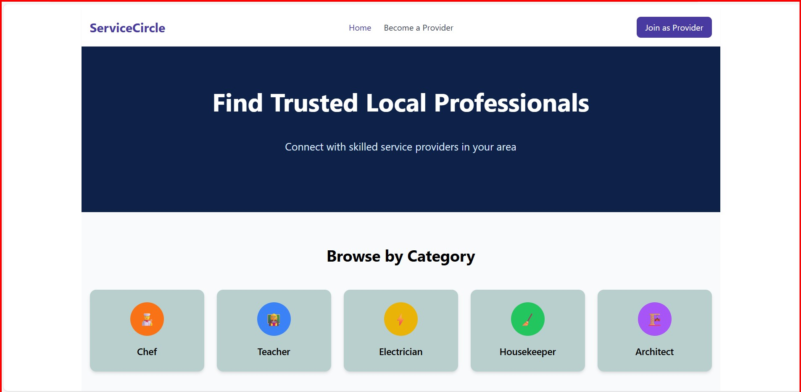

# ServiceCircle

**ServiceCircle** ServiceCircle is a modern, React-based web application designed to act as a local services marketplace. It helps users easily discover and connect with skilled service professionals in their area — including chefs, electricians, housekeepers, teachers, architects, and more.
🔍 User-friendly Search Experience
🧑‍🍳 Multi-step Registration for Service Providers
📸 Visual Profiles
 Modern Tech Stack

## 🚀 Features

- 🧑‍🍳 Register as a service provider
- 🔍 Filter by location, category, and rating
- 💬 Contact service providers
- 📸 Upload profile photo and work samples
- ⚡ Fast and responsive UI

## 🧰 Tech Stack

| Frontend      | Tools & Libraries                  |
|---------------|------------------------------------|
| 🖥️ Framework  | React + Vite                       |
| 🎨 Styling    | Tailwind CSS                       |
| 🧭 Routing    | React Router DOM                   |
| 🔔 Toasts     | React Toastify                     |
| 📦 Icons      | Lucide React                       |
| 📁 State Mgmt | React Context API (lightweight)    |

---

## 📸 Live Preview

Check out the live deployed version of ServiceCircle here:
🔗   https://service-circle-sable.vercel.app/

## 🧑‍💻 Developer

**Mitali Kumari** – `Full-stack Developer`  
🎓 B.Tech – IIT Patna  
💼 Skilled in MERN, DSA, Competitive Programming  

🔗 [GitHub](https://github.com/Mitali-119) | [LinkedIn](https://www.linkedin.com/in/mitali-kumari-6a196828a)

